# Neura Python Frontend

Compile PyTorch `nn.Module` to Neura CGRA dataflow IR, with full lowering pipeline and end-to-end numerical validation.

---

## Table of Contents

- [Quick Start](#quick-start)
- [Architecture](#architecture)
- [Frontend Pipeline](#frontend-pipeline)
- [New Pass Design](#new-pass-design)
- [Interpreter Implementation](#interpreter-implementation)
- [Arithmetic Lowering](#arithmetic-lowering)
- [Testing](#testing)
- [Dependencies](#dependencies)

---

## Quick Start

### Environment Setup

```bash
# 1. Create conda environment
conda env create -f tools/neura-py-frontend/environment.yml
conda activate neura-torch

# 2. Build the project
mkdir -p build && cd build
cmake .. -DMLIR_DIR=/path/to/llvm-project/build/lib/cmake/mlir \
         -DLLVM_DIR=/path/to/llvm-project/build/lib/cmake/llvm
make -j$(nproc) mlir-neura-opt neura-interpreter neura-compiler neura-py-frontend
```

Key binaries after build:

| Binary | Purpose |
|--------|---------|
| `build/tools/mlir-neura-opt/mlir-neura-opt` | MLIR pass driver |
| `build/tools/neura-interpreter/neura-interpreter` | Neura IR interpreter |
| `build/tools/neura-compiler/neura-compiler` | Compiler frontend |
| `build/tools/neura-py-frontend/neura-py-frontend` | Convenience shell wrapper |

### CLI Usage

```bash
# Full pipeline from a PyTorch model
python tools/neura-py-frontend/neura_pipeline.py \
    --model path/to/model.py \
    --example-shape 4 8 \
    --output output.json

# From existing Linalg-on-Tensors .mlir
python tools/neura-py-frontend/neura_pipeline.py \
    --input linalg_ir.mlir \
    --output output.json

# Stop after Stage 2 (Neura dialect, before codegen)
python tools/neura-py-frontend/neura_pipeline.py \
    --input linalg_ir.mlir \
    --output output.mlir \
    --stop-after taskflow

# With CGRA architecture spec
python tools/neura-py-frontend/neura_pipeline.py \
    --model model.py \
    --example-shape 4 8 \
    --arch-spec test/arch_spec/architecture.yaml \
    --output output.json
```

### CLI Options

| Option | Description |
|--------|-------------|
| `--model`, `-m` | Path to `.py` file exposing a `model` attribute |
| `--input`, `-i` | Path to existing Linalg-on-Tensors `.mlir` |
| `--output`, `-o` | Output path (default: `output.json`) |
| `--stop-after` | Stop after: `affine`, `taskflow`, or `neura` (default) |
| `--keep-intermediate` | Keep intermediate `.mlir` files on disk |
| `--func-name` | Function name for torch-mlir export (default: `forward`) |
| `--example-shape` | Example input shape, e.g. `1 3 224 224` |
| `--arch-spec` | Path to CGRA architecture spec YAML |

`--model` and `--input` are mutually exclusive.

### Programmatic API

```python
from neura_pipeline import (
    export_pytorch_to_linalg,   # PyTorch .py → Linalg-on-Tensors .mlir
    lower_linalg_to_affine,     # Linalg → Affine
    lower_affine_to_neura,      # Affine → Neura
    lower_neura_to_codegen,     # Neura → CGRA Codegen
    full_pipeline,              # Linalg → Codegen in one call
)

# Step by step
export_pytorch_to_linalg("model.py", "linalg.mlir", example_shape=[1, 3, 224, 224])
lower_linalg_to_affine("linalg.mlir", "affine.mlir")
lower_affine_to_neura("affine.mlir", "neura.mlir")
lower_neura_to_codegen("neura.mlir", "output.json")

# Or all at once
full_pipeline(
    input_mlir="linalg.mlir",
    output_file="output.json",
    arch_spec=None,
    stop_after=None,
    keep_intermediate=False,
)
```

### Model File Convention

Each model `.py` must expose a `torch.nn.Module` instance named `model`:

```python
import torch
import torch.nn as nn

class SimpleMatMul(nn.Module):
    def __init__(self):
        super().__init__()
        self.weight = nn.Parameter(torch.randn(8, 8))

    def forward(self, x):
        return torch.matmul(x, self.weight)

model = SimpleMatMul()
```

8 built-in test models under `test/Conversion/python2neura/model_tests/models/`:
`simple_matmul`, `residual_block`, `residual_block_norelu`, `two_layer_mlp`,
`two_layer_mlp_norelu`, `conv2d_relu_pool`, `transformer_attention`, `gelu_layernorm`.

---

## Architecture

### Overall Flow

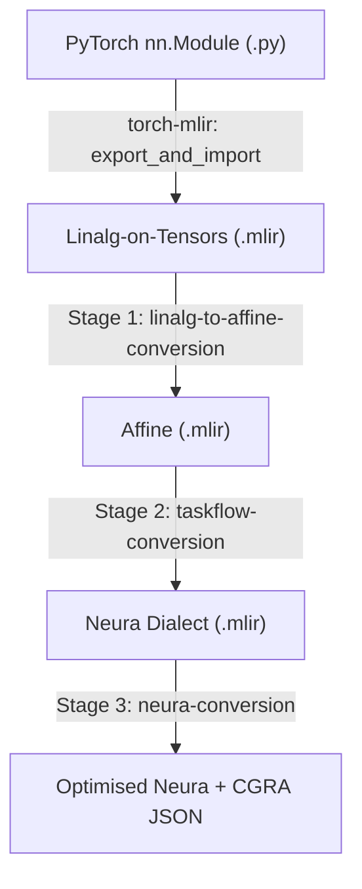

### File Layout

| File | Purpose |
|------|---------|
| `neura_pipeline.py` | Python API + CLI for the full lowering pipeline |
| `neura-py-frontend.sh` | Shell convenience wrapper |
| `CMakeLists.txt` | Installs scripts into build output directory |
| `environment.yml` | Conda environment (torch + torch-mlir) |

Tool auto-discovery: `neura_pipeline.py` resolves `mlir-neura-opt` by checking the build directory relative to the script location first, then falls back to system `PATH`.

---

## Frontend Pipeline

The pipeline consists of 4 stages:

```mermaid
flowchart LR
    subgraph Stage0["Stage 0: Export"]
        direction LR
        S0A["model.py<br/>nn.Module"] --> S0B["torch-mlir<br/>export_and_import"]
        S0B --> S0C["Linalg IR"]
    end

    subgraph Stage1["Stage 1: Lowering"]
        direction LR
        S1A["Linalg IR"] --> S1B["Bufferize<br/>Linalg→Affine"]
        S1B --> S1C["Expand<br/>Math→Arith"]
        S1C --> S1D["Affine IR"]
    end

    subgraph Stage2["Stage 2: Taskflow"]
        direction LR
        S2A["Affine IR"] --> S2B["Affine→Taskflow"]
        S2B --> S2C["Taskflow→Neura"]
        S2C --> S2D["Neura IR"]
    end

    subgraph Stage3["Stage 3: Codegen"]
        direction LR
        S3A["Neura IR"] --> S3B["Strip Task"]
        S3B --> S3C["Pattern Fuse<br/>+ Data Mov"]
        S3C --> S3D["CGRA JSON"]
    end

    Stage0 --> Stage1 --> Stage2 --> Stage3
```

### Stage 0: PyTorch → Linalg-on-Tensors

Implemented in `export_pytorch_to_linalg()`:

```python
from torch_mlir.fx import export_and_import, OutputType

mlir_module = export_and_import(
    model, example_input,
    output_type=OutputType.LINALG_ON_TENSORS,
    func_name="forward",
)
```

**Key adaptation for torch-mlir 20260531:** The old `torch_mlir.compile()` was deprecated. The new API uses:
- `torch_mlir.fx.export_and_import()` instead of `compile()`
- `OutputType.LINALG_ON_TENSORS` enum instead of the `"linalg-on-tensors"` string

Models are loaded dynamically via `importlib`, requiring a `model` attribute of type `nn.Module`.

### Stage 1: Linalg → Affine

Registered in `lib/TaskflowDialect/TaskflowPasses.cpp` as `--linalg-to-affine-conversion`:

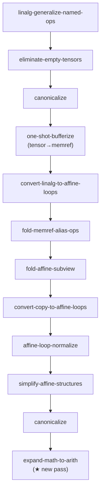

The final `expand-math-to-arith` pass is critical — it expands `math.fpowi` and `math.tanh` into `arith` ops before they get promoted into kernel block arguments, where constant exponents would be hidden.

### Stage 2: Affine → Taskflow → Neura

Registered in `lib/TaskflowDialect/TaskflowPasses.cpp` as `--taskflow-conversion`:

```
convert-affine-to-taskflow → construct-hyperblock-from-task
→ classify-task-and-counter → convert-taskflow-to-neura
```

Output is Neura dialect IR. Use `--stop-after taskflow` to intercept here.

### Stage 3: Neura → Optimised + CGRA Codegen

Registered in `lib/NeuraDialect/NeuraPasses.cpp` as `--neura-conversion`:

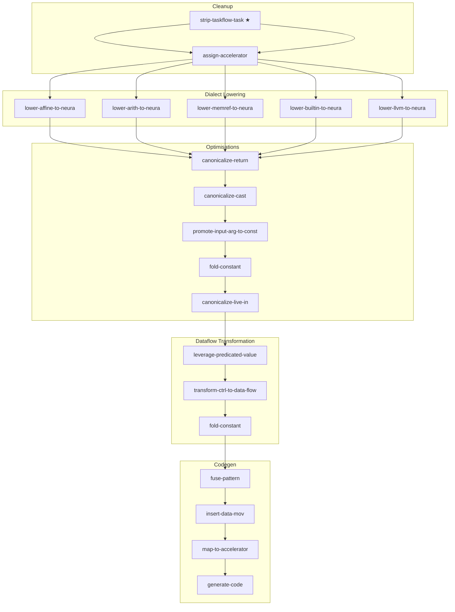

All three stages can also be folded into a single pipeline via `--python-to-neura`.

---

## New Pass Design

### `expand-math-to-arith`: Pre-expand Math Ops

**File:** `lib/Conversion/ExpandMathToArith/ExpandMathToArithPass.cpp`

**Motivation:** Stage 2's taskflow conversion promotes constants to kernel block arguments. Once promoted, expressions like `x^3` (used in GELU's tanh approximation) no longer see a visible constant exponent, making expansion into `arith.mulf` chains impossible. This pass runs before affine-loop lowering to guarantee all exponents are constant-foldable.

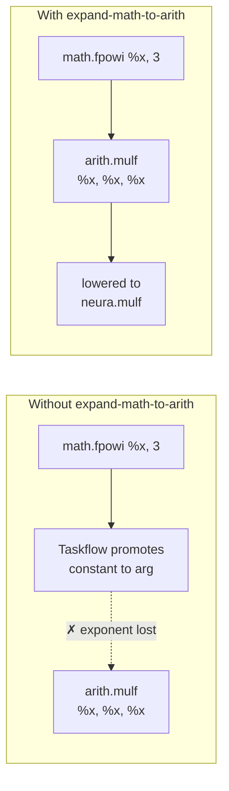

**Patterns:**

| Pattern | Input | Output |
|---------|-------|--------|
| `ExpandFPowI` | `math.fpowi(x, const_n)` n≥1 | `x * x * ... * x` (n times) |
| `ExpandTanh` | `math.tanh(x)` | `(exp(2x) - 1) / (exp(2x) + 1)` |

These decomposed ops are later lowered to `neura.mulf`, `neura.exp`, `neura.subf`, `neura.divf` by `ArithToNeura`.

**Registration chain:**

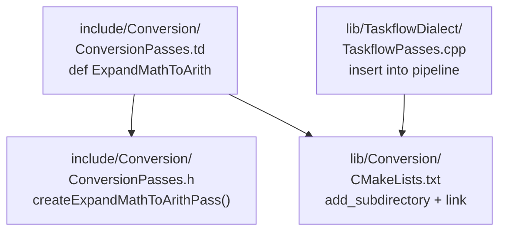

### `strip-taskflow-task`: Remove Taskflow Containers

**File:** `lib/Conversion/TaskflowToNeura/StripTaskflowTaskPass.cpp`

**Motivation:** Stage 3 needs pure Neura dialect, but Stage 2 output wraps `neura.kernel` inside `taskflow.task`. This pass is the first step of Stage 3 — it lifts kernels to the parent function level.

**Algorithm:**

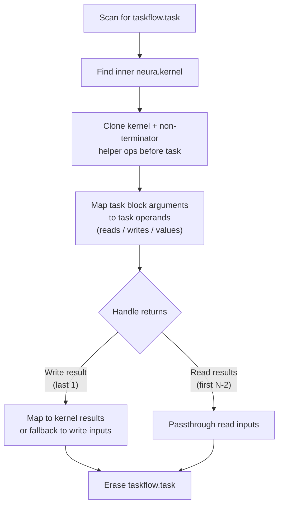

---

## Interpreter Implementation

**File:** `tools/neura-interpreter/neura-interpreter.cpp` (+2181 lines)

The interpreter executes Neura IR in two modes: **control-flow** (CF, sequential instruction dispatch) and **dataflow** (DF, dependency-graph-driven scheduling). The Python frontend tests invoke both.

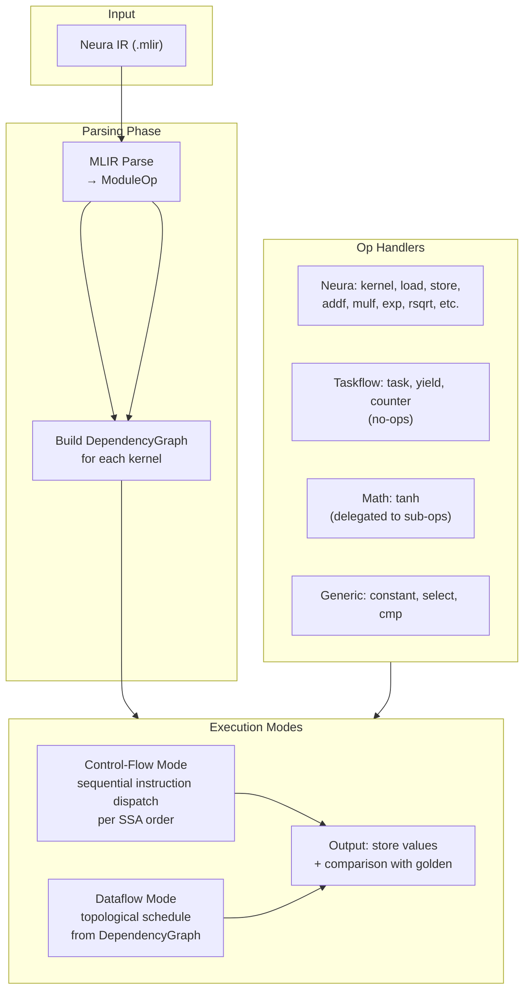

### Taskflow Op Handling

The interpreter must process three taskflow ops that appear in Stage 2 output:

| Op | Strategy | Rationale |
|----|----------|-----------|
| `taskflow.task` | No-op + frame push | Body is already expanded during collection; acts as frame push to enter task body |
| `taskflow.yield` | No-op | Terminator, skipped during execution |
| `taskflow.counter` | No-op | Wraps `neura.counter`; semantics handled by kernel counter ops |

### Dataflow Dependency Graph Enhancement

The `DependencyGraph::build()` was extended with a second phase: **memory dependency analysis**.

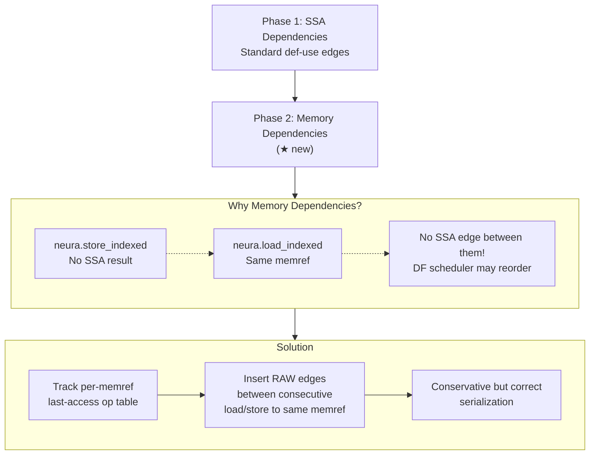

**The problem:** In dataflow mode, kernel body ops are flattened into a single sequence. `neura.store_indexed` has no SSA result, so subsequent `neura.load_indexed` on the same memref lacks an SSA dependency edge, potentially causing read-write reordering.

**The fix:** Maintain a `memref_last_op` table during graph construction. For each load/store on the same memref, insert RAW (Read-After-Write), WAR (Write-After-Read), and WAW (Write-After-Write) dependency edges.

**Problem — no dependency edges, ops can reorder:**

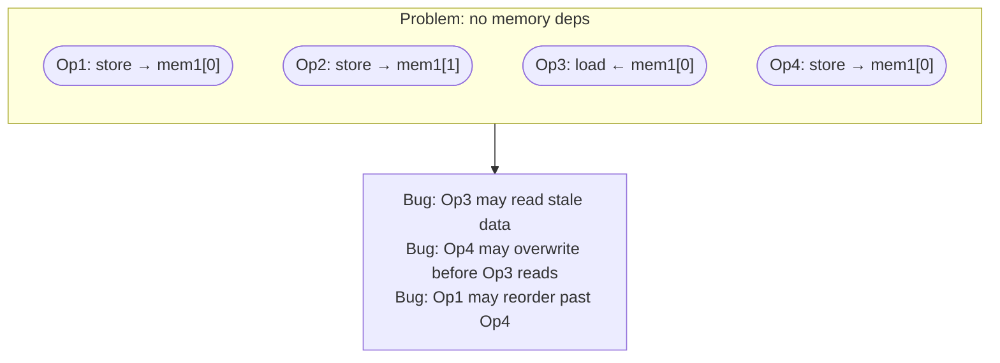

**Solution — `memref_last_op` table + RAW / WAR / WAW edges:**

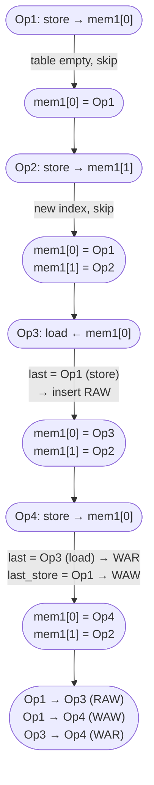

**Final dependency graph — 4 ops, 3 edges, correct ordering:**

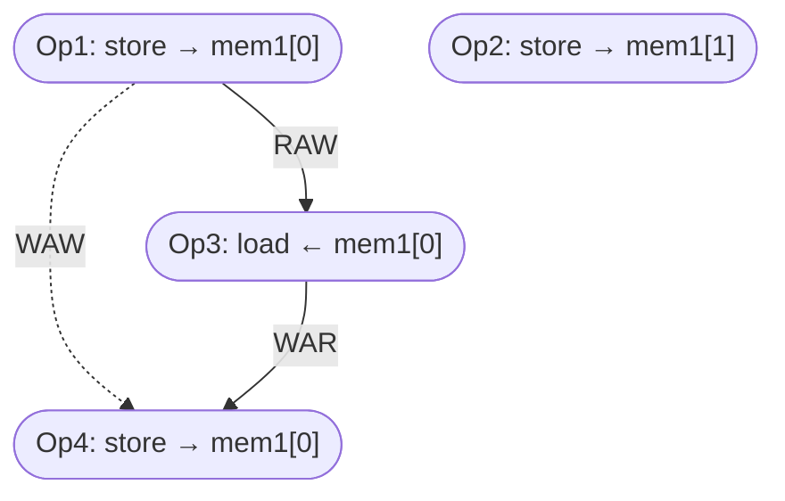

### Simulated Memory

- `neura.load_indexed` / `neura.store_indexed`: use a `simulated_memory` hashmap (`unordered_map<string, float>`) keyed by `"memref_name.index"` for reads and writes
- `math.tanh`: treated as no-op in the handler — its expanded sub-ops (`math.exp`, `arith.*`) are handled individually

### `neura.kernel`: CGRA Offload Unit

`neura.kernel` is the fundamental **hardware computation unit** in Neura. It marks a region to be offloaded to a CGRA (Coarse-Grained Reconfigurable Architecture) accelerator.

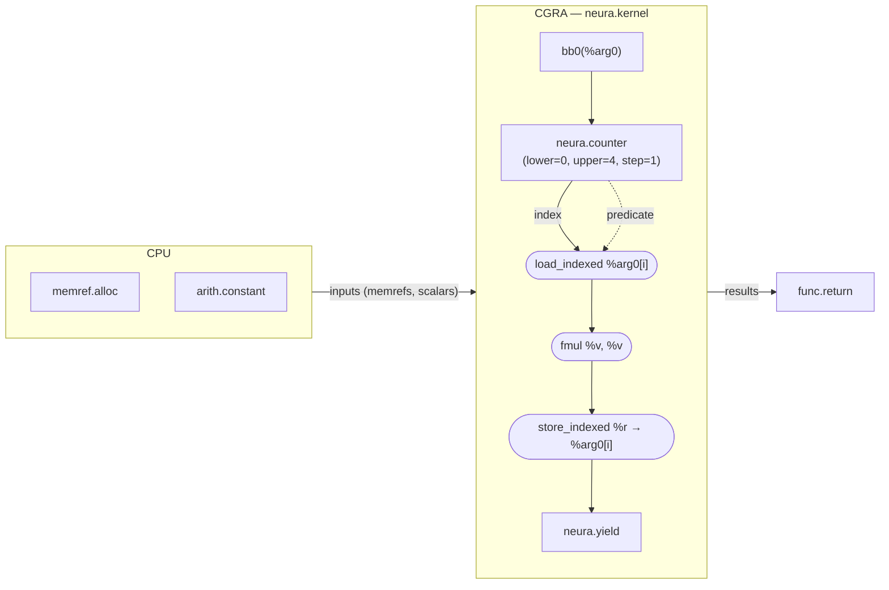

**IR structure:**

```mlir
neura.kernel inputs(%mem : memref<4xf32>) attributes {accelerator = "neura"} {
^bb0(%arg0: memref<4xf32>):   // block args map 1:1 to inputs
  %i = neura.counter ... -> !neura.data<i64, i1>
  %v = neura.load_indexed %arg0[%i] : memref<4xf32> -> f32
  %r = neura.fmul %v, %v : (f32, f32) -> f32
  neura.store_indexed %r -> %arg0[%i] : f32, memref<4xf32>
  neura.yield
}
```

| Component | Role |
|-----------|------|
| `inputs(...)` | Values captured from outside (memrefs, scalars) — must be explicit because kernel is `IsolatedFromAbove` |
| block args | 1:1 mapping to `inputs`; serve as local handles inside the kernel body |
| `neura.counter` | Hardware loop iterator: produces current index + `i1` predicate for gating |
| body ops | `load_indexed` / compute / `store_indexed` chain — pure dataflow inside the kernel |
| `neura.yield` | Terminator; optionally returns `iter_args_next` and `results` |

**Conceptually:** a `neura.kernel` is like a GPU kernel launch — it captures inputs from the CPU, runs an entire nested loop on the accelerator, and returns results. Multiple kernels in one function run **sequentially**, forming a pipeline of offloaded compute stages.

### Kernel-Level Scheduling

The interpreter supports two execution modes:

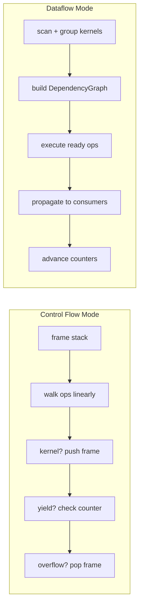

#### Phase 1: Kernel Discovery

Scans the top-level `func.func` body, separating `neura.kernel` into groups and collecting non-kernel init ops (`arith.constant`, `memref.alloc`, etc.):

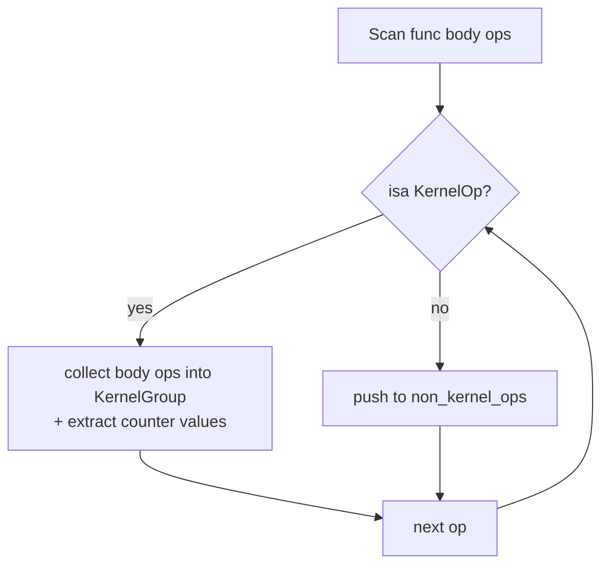

#### Phase 2: Execute Non-Kernel Init Ops

Constants, `memref.alloc`, `memref.get_global` run once via `DependencyGraph` to initialise the environment before any kernel executes.

#### Phase 3: Kernel Scheduling Loop

**Inter-kernel: sequential.** Kernels run one after another to prevent cross-kernel read-write reordering.

**Intra-kernel: dataflow-driven.** Inside each kernel, ops execute when all their producers have finished:

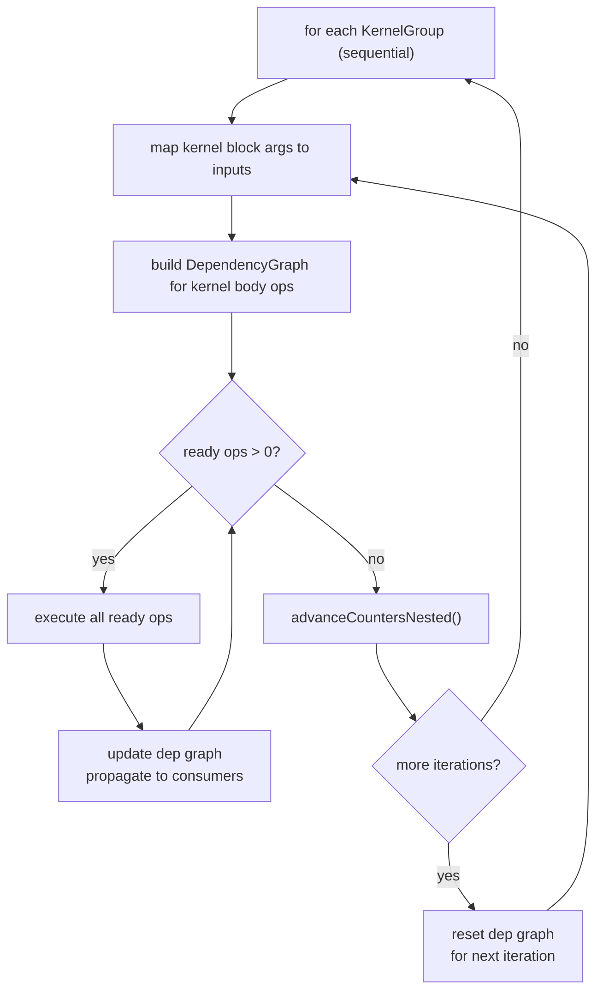

#### Counter Mechanism: Nested Loop Iteration

Each `neura.kernel` may contain **counter ops** that drive loop execution — the hardware equivalent of `for (i = 0; i < N; i += 1)`. A counter has:

- **bounds** (lower / upper / step) — define the iteration range
- **current index** — the loop variable, exposed as an SSA value for indexing (e.g. `memref[x][i]`)
- **predicate** — an `i1` flag: `true` while in bounds, `false` on overflow; downstream ops use this to gate execution in hardware

**Nested loops** use a counter hierarchy: **leaf** (innermost) → **relay** (middle) → **root** (outer). When inner counter overflows, it resets to `lower` and carries into the next outer counter — exactly like nested `for` loops in software.

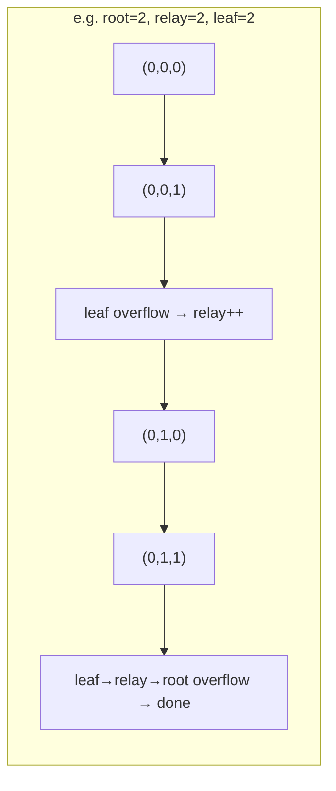

The carry-propagation algorithm:

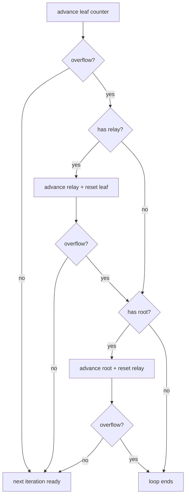

**Summary:** kernels run sequentially; kernel-internal ops execute dataflow-style via `DependencyGraph` (SSA + memory deps); loop iterations are driven by hardware counter carry-propagation.

---

## Arithmetic Lowering

**File:** `lib/Conversion/ArithToNeura/ArithToNeuraPass.cpp`

To support complex models like GELU and LayerNorm, new arith/math → neura conversions were added:

| Pattern | Source Op | Target Op | Trigger Model |
|---------|-----------|-----------|---------------|
| `ArithCmpFToNeuraFCmp` | `arith.cmpf` | `neura.fcmp` | ReLU / GELU / LayerNorm |
| `MathExpToNeuraExp` | `math.exp` | `neura.exp` | GELU (tanh expansion) |
| `MathRsqrtToNeuraRsqrt` | `math.rsqrt` | `neura.rsqrt` | LayerNorm |
| `MathFPowIToNeuraMuls` | `math.fpowi` | `arith.mulf` chain | GELU (fallback) |
| `MathTanhToNeuraOps` | `math.tanh` | `exp + arith` chain | GELU tanh approx |

### Critical Fix: `arith.cmpf` Type Mismatch

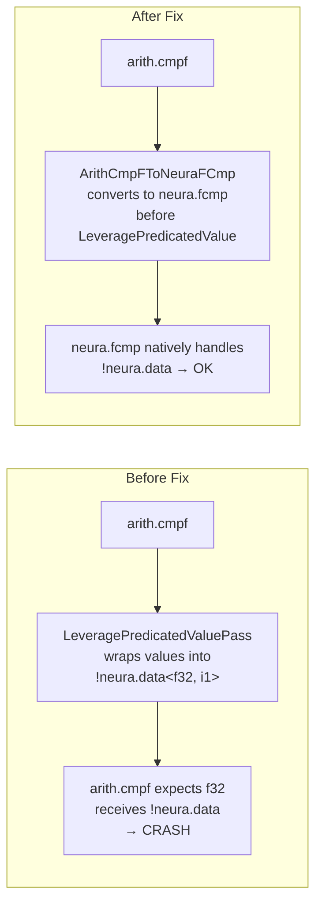

`arith.cmpf` expected `f32` but received `!neura.data<f32, i1>` after the `LeveragePredicatedValuePass` performed type wrapping. Converting to `neura.fcmp` ahead of time ensures the type system remains consistent.

---

## Testing

### End-to-End Numerical Tests

**File:** `test/Conversion/python2neura/model_tests/test_models.py`

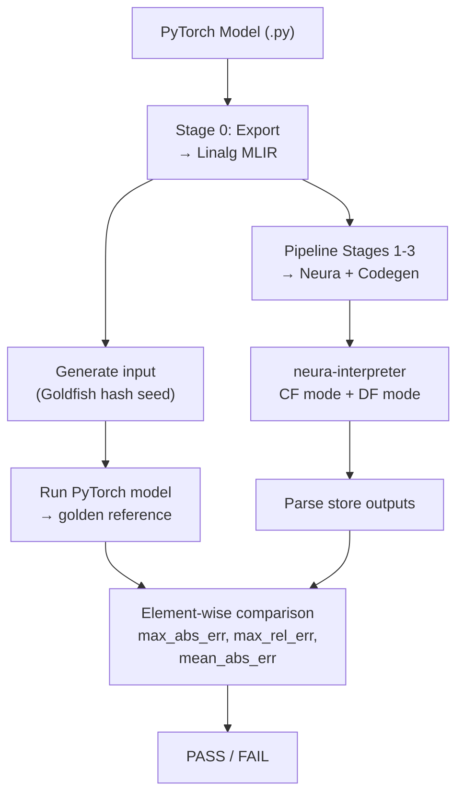

**8 test models:**

| Model | Input Shape | Key Ops |
|-------|-------------|---------|
| `simple_matmul` | [4, 8] | matmul |
| `residual_block` | [4, 8] | matmul + add + relu |
| `residual_block_norelu` | [4, 8] | matmul + add |
| `two_layer_mlp` | [2, 8] | two-layer matmul + relu |
| `two_layer_mlp_norelu` | [2, 8] | two-layer matmul |
| `conv2d_relu_pool` | [1, 9] | conv2d + relu + max_pool2d |
| `transformer_attention` | [4, 8] | multi-head attention |
| `gelu_layernorm` | [4, 8] | GELU + LayerNorm |

**Run:**

```bash
conda activate neura-torch

# Control-flow mode
python test/Conversion/python2neura/model_tests/test_models.py

# Dataflow mode
python test/Conversion/python2neura/model_tests/test_models.py --dataflow
```

**Results (all 8/8 pass):**

```
============================================================
  E2E TEST SUMMARY
============================================================
  simple_matmul                  OK PASS
  residual_block                 OK PASS
  residual_block_norelu          OK PASS
  two_layer_mlp                  OK PASS
  two_layer_mlp_norelu           OK PASS
  conv2d_relu_pool               OK PASS
  transformer_attention          OK PASS
  gelu_layernorm                 OK PASS

  8/8 models passed
```

Precision (simple_matmul example): `max_abs_err=4.66e-09 max_rel_err=2.64e-06 mean_abs_err=7.90e-10`

### Lit Static Regression Tests

Pre-generated `.mlir` files with embedded `RUN` + `CHECK` directives:

```bash
llvm-lit test/Conversion/python2neura/model_tests/generated/
```

To regenerate:

```bash
python test/Conversion/python2neura/model_tests/generate_mlir.py \
    --output-dir test/Conversion/python2neura/model_tests/generated --lit
```

---

## Key Fixes Summary

| Problem | Root Cause | Fix |
|---------|------------|-----|
| torch-mlir API break | `compile()` → `export_and_import()` | Adopt new API + `OutputType` enum |
| GELU `x^3` not expandable | Constant exponent hidden after promotion | `expand-math-to-arith` pass before affine lowering |
| `arith.cmpf` type mismatch | Predicated value wrapping conflicts with f32 input | `ArithCmpFToNeuraFCmp` converts to `neura.fcmp` first |
| DF mode read-write reorder | `store_indexed` has no SSA result | Per-memref memory dependency edges in DependencyGraph |
| Interpreter "Unhandled op" | Taskflow ops not handled | No-op branches for `taskflow.task/yield/counter` |

---

## Dependencies

- Python 3.11+
- `torch` (≥ 2.3.0)
- `torch-mlir` (20260531.828)
- `numpy`
- Project binaries: `mlir-neura-opt`, `neura-interpreter`, `neura-compiler`

Install via conda:

```bash
conda env create -f tools/neura-py-frontend/environment.yml
```

**Build integration:**

- CMake target `neura-py-frontend` copies scripts to `build/tools/neura-py-frontend/`
- New passes registered in `include/Conversion/ConversionPasses.td` + `.h`
- Pass pipeline integration in `lib/TaskflowDialect/TaskflowPasses.cpp`
- Interpreter updates in `tools/neura-interpreter/neura-interpreter.cpp`

---

## File Changes (vs main)

**44 files, +5726/-293 lines:**

| Category | Files | Type |
|----------|-------|------|
| Frontend scripts | `neura_pipeline.py`, `neura-py-frontend.sh`, `CMakeLists.txt` | Added |
| Docs & config | `README.md`, `environment.yml` | Added |
| New passes | `ExpandMathToArith/`, `StripTaskflowTaskPass.cpp` | Added |
| Interpreter | `neura-interpreter.cpp` | Modified |
| Arithmetic conversion | `ArithToNeuraPass.cpp` | Modified |
| Pass registration | `ConversionPasses.h/.td`, `NeuraOps.td`, `CMakeLists.txt` | Modified |
| Test models | `models/*.py` (8), `generated/*.mlir` (8) | Added |
| Test scripts | `test_models.py`, `generate_mlir.py` | Added |
